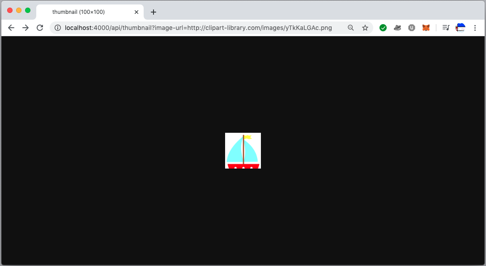

# TestApp

## Elixir is harder than I thought! 

My code is a bit of hack, it is the first time doing anything substantial with Elixir. 

If you would like something cleaner, I'll do a version in Ruby.

Two endpoints:

1. An endpoint which will validate your file is an image and return key metadata (filetype, size, dimensions)

http://localhost:4000/api/info/?image-url=https://i.imgur.com/InTf1LQ.jpg

```
%Mogrify.Image{animated: false, buffer: nil, dirty: %{}, ext: ".jpg", format: "jpeg", frame_count: 1, height: 2592, operations: [], path: "/Users/leocampbell/Sites/test_app/assets/static/images/InTf1LQ.jpg", width: 3888}
```

2. An endpoint which will return a resized version of your image file

http://localhost:4000/api/thumbnail/?image-url=http://clipart-library.com/images/yTkKaLGAc.png

Image resized to 100x100.



